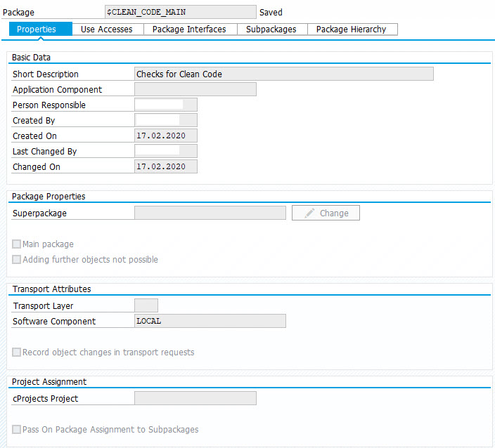
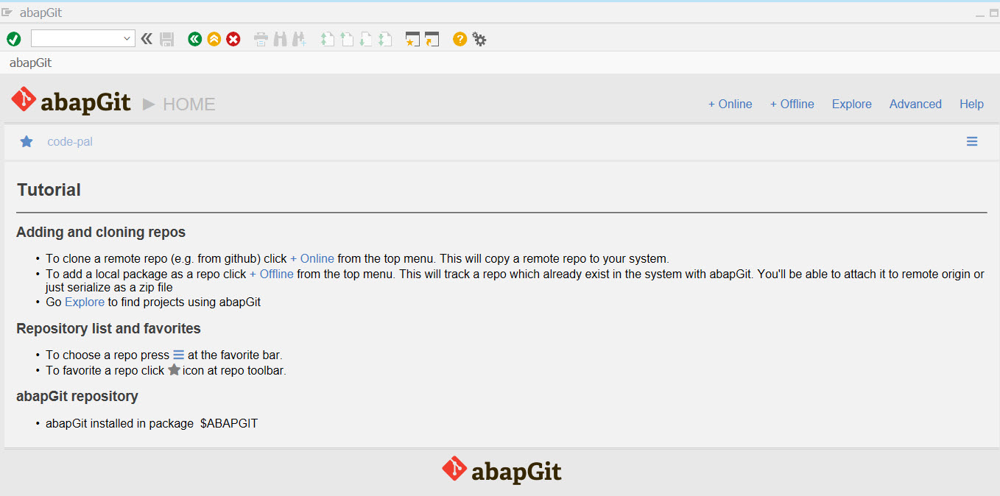
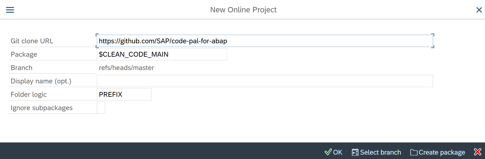
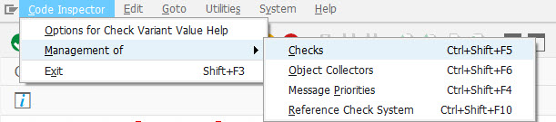
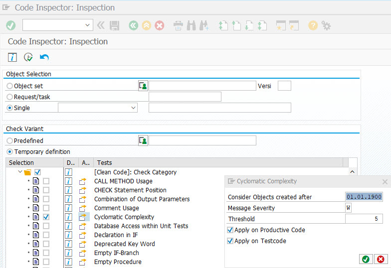

# Code Pal for ABAP

***Note: Netweaver release 7.40 SP8 or higher is required.***

Code pal is a tool which supports you in writing clean ABAP code. Clean Code allows you to read your code like well-written prose, it is easily understandable, maintainable and extensible. In addition, you can write high quality and reliable Unit Tests without hurdles and hereby reduce the total cost of ownership of the software.

Furthermore... It's free and open source: code pal is licensed under the Apache License, Version 2.0 - see [LICENSE](LICENSE)

* [Features](#features)
* [How to bring Code Pal into your system?](#how-to-bring-code-pal-into-your-system)
  * [1. Create a local package](#1-create-a-local-package)
  * [2. Start Transaction ZABAPGIT](#2-start-transaction-zabapgit)
  * [3. Include the new Checks into Code Inspector](#3-include-the-new-checks-into-code-inspector)
* [How to use Code Pal](#how-to-use-code-pal)
* [Further Reading](#further-reading)
* [Other interesting projects](#other-interesting-projects)

## Features
- Checks can be executed via Code Inspector and via ATC (e.g. within SE80, Eclipse)
- Automatic Exclusion of Code which shall not be checked (like generated code, …)
- Execution of Checks is User-based
- Scope is customizable (via the object creation date)
- Thresholds are customizable
- Message severity is customizable (e.g. error, warning, notification, …)
- Checking productive code and/or test code is customizable
- Findings can be suppressed via Code Inspector Pragmas

## How to bring Code Pal into your system
### 1. Create a local package
Create a local package in which you can pull the git repository (for example $CLEAN_CODE_MAIN)

### 2. Start Transaction ZABAPGIT*

  Press 'Online' in the menu and provide the following information as seen in the screenshot. As package use the same name as the one   created in step (1):

*In case transaction ZABAPGIT is not present in your system, please follow this link which describes the installation procedure and the complete user guide and documentation of abapGit:
https://docs.abapgit.org/

### 3. Include the new Checks into Code Inspector
Start transaction SCI and tick the newly added Clean Code Checks in the "Check Management" section (Ctrl+Shift+F5):

(In some system releases, the path to the Check Management might differ from the screenshot.)

Please make sure to activate `Y_CHECK_CATEGORY` first and alone, since it is a prerequisite of all checks. Afterwards, you might activate all checks you wish in any sequence/order.

## How to use Code Pal
When code pal is in your system, just go to Transaction `SCI` or `SCII` and execute the Checks with your prefered Thresholds. To have a consistent set of Checks and Thresholds you can always create a Code Inspector Variant.

To understand how the checks work, please refer to the [Check Documentation](/docs/check_documentation.md).

Then simply execute the Checks.

Note: You can simulate the checks using the `Y_DEMO_FAILURES` class. 

## Further Reading
* [ABAP Styleguides on Clean Code](https://github.com/SAP/styleguides/blob/master/clean-abap/CleanABAP.md)

## Other interesting projects
* [ABAPgit](https://github.com/larshp/abapGit)
* [ABAP Open Checks](https://github.com/larshp/abapOpenChecks)
* [Many ABAP Open Source Projects](https://dotabap.org/)
