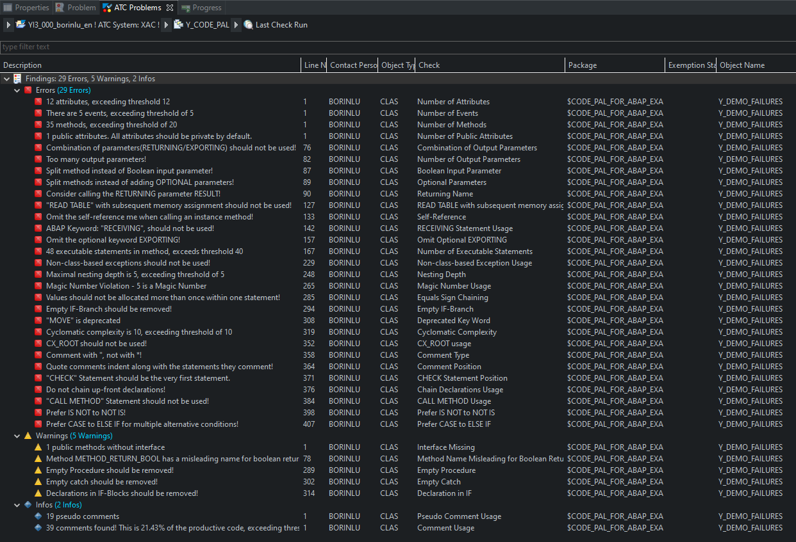

# Code Pal for ABAP

This tool supports you in writing a clean ABAP code. Clean Code allows you to read your code like well-written prose, it is easily understandable, maintainable, and extensible. In addition, you can write high quality and reliable Unit Tests without hurdles and thereby reduce the total cost of ownership of the software.

Furthermore... It's **free** and **open-source**!

It is licensed under the Apache License, Version 2.0 - see [LICENSE](LICENSE).

## Features

- Checks ready-to-use
- Checks can be executed via Code Inspector and via ATC (e.g. within SE80, Eclipse)
- Automatic Exclusion of Code which shall not be checked (like generated code, …)
- Execution of Checks is user-based or group-based (using profile feature)
- The scope is customizable (via the object creation date)
- Thresholds are customizable
- Message severity is customizable (error, warning, or notification)
- Checking productive code and/or test code is customizable
- Findings can be suppressed via Code Inspector Pragmas

## Example

## Dependencies

- **SAP NetWeaver 7.40 SP8 or higher**
- [abapGit](https://docs.abapgit.org/)

## How-to Guides

- **[Install](pages/how-to-install.md)**
- **[Configure](pages/how-to-configure.md)**
- **[Execute](pages/how-to-execute.md)**
- **[Contribute](pages/how-to-contribute.md)**

## Further Reading

- [Style Guides - Clean ABAP](https://github.com/SAP/styleguides/blob/master/clean-abap/CleanABAP.md)
