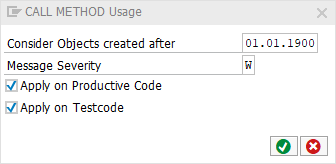

# Code Pal for ABAP

[Code Pal for ABAP](../../README.md) > [Documentation](../check_documentation.md) > [CALL METHOD Usage Check](call-method-usage.md)

## CALL METHOD Usage Check

### What is the Intent of the Check?

The "Call Method Usage" check verifies the usage of the `CALL METHOD` ABAP statement. It is preferable not to call a method via this statement: CALL METHOD. Since it is preferable functional instead of procedural calls.

### How does the check work?

It simply checks if the code is using the `CALL METHOD` statement.

### Which attributes can be maintained?



### How to solve the issue?

Change the long method calls using `CALL METHOD` statement to short method calls using parenthesis notation.

### What to do in case of exception?

You can suppress Code Inspector findings generated by this check using the pseudo comment `"#EC CALL_METH_USAGE`. The pseudo comment has to be placed after the `CALL METHOD` statement.

```abap
CALL METHOD method_name. "#EC CALL_METH_USAGE
```

### Example

Before the check:

```abap
DATA(class) = NEW object( ).
CALL METHOD class->method.
```

After the check:

```abap
DATA(class) = NEW object( ).
class->method( ).
```

### Further Readings & Knowledge

* [ABAP Styleguides on Clean Code](https://github.com/SAP/styleguides/blob/master/clean-abap/CleanABAP.md#prefer-functional-to-procedural-calls)
