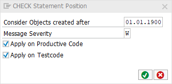

# code pal for ABAP

[code pal for ABAP](../../README.md) > [Documentation](../check_documentation.md) > [CHECK Statement Position Check](check-statement-position.md)

## CHECK Statement Position Check

### What is the Intent of the Check?
The "Check Statement Position" verifies whether the `CHECK` statement is in the first position (first statement) within a method, function-module or form-routine.  
Do not use `CHECK` outside of the initialization section of a method. The statement behaves differently in different positions and may lead to unclear, unexpected effects.

### Which attributes can be maintained?


### How to solve the issue?
The `CHECK` statement shall be the first statement of a method (suggested even before any DATA declaration);  
If not, try to substitute this keyword by an IF-statement instead.

### What to do in case of exception?
In special cases you can suppress this finding by using the pseudo comment `"#EC CHECK_POSITION`.

### Example
Before the check:
```abap
METHOD example.
  ...
  CHECK sy-mandt = 000.
  ...
ENDMETHOD.
```

After the check:
```abap
METHOD example.
  ...
  IF sy-mandt <> 000.
    RETURN.
  ENDIF.
  ...
ENDMETHOD.
```
```abap
METHOD example.
  CHECK sy-mandt = 000.
  ...
ENDMETHOD.
```

### Further Readings & Knowledge
- [Avoid CHECK in other positions (Clean ABAP)](https://github.com/SAP/styleguides/blob/master/clean-abap/CleanABAP.md#avoid-check-in-other-positions)
