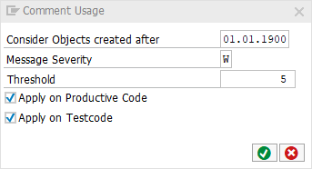

[BACK](../check_documentation.md)

# Comment Usage Check
## What is the Intent of the Check?
The “Comment Usage” Check is part of the Clean Code Check Repository. Express yourself in code, not in comments. Clean Code does not forbid you to comment your code - it encourages you to exploit better means, and resort to comments only if that fails.

## How does the check work?
This check calculates the percentage of comments in relation to the absolute number of statements (productive code).

## Which attributes can be maintained?

## How to solve the issue?
Remove unimportant comments.

## What to do in case of exception?
There should be no exception as the check works as an indication. Thus, it is also not possible to suppress Code Inspector findings from this check.

## Further Readings & Knowledge
* [ABAP Styleguides on Clean Code](https://github.com/SAP/styleguides/blob/master/clean-abap/CleanABAP.md#express-yourself-in-code-not-in-comments)
