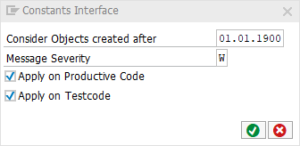

# Code Pal for ABAP

[Code Pal for ABAP](../../README.md) > [Documentation](../check_documentation.md) > [Constants Interface Check](constants-interface.md)

## Constants Interface Check

### What is the Intent of the Check?

You should always prefer enumeration classes to constants interfaces.

### How does the check work?

The check searches for interfaces with only constants.

### Which attributes can be maintained?



### How to solve the issue?

Use enumeration classes instead.

### What to do in case of exception?

In special cases, it is possible to suppress a finding by using the pseudo comment `"#EC CONS_INTF`.  
The pseudo comment must be placed right after the class definition header.

### Example

```abap
INTERFACE interface_name.   "#EC CONS_INTF
    CONSTANTS two TYPE i VALUE 2.
ENDINTERFACE.
```

### Further Readings & Knowledge

* [ABAP Styleguides on Clean Code](https://github.com/SAP/styleguides/blob/master/clean-abap/CleanABAP.md#prefer-enumeration-classes-to-constants-interfaces)
