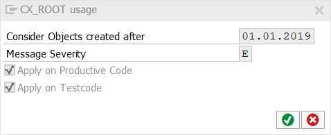

# code pal for ABAP

[code pal for ABAP](../../README.md) > [Documentation](../check_documentation.md) > [CX_ROOT Usage Check](cx-root-usage.md)

## CX_ROOT Usage Check

### What is the Intent of the Check?

The “CX_ROOT Usage" Check searches for merely "CX_ROOT" exceptions being directly used in the code (e.g.: In a TRY-CATCH block). 

### How does the check work?

It search for the "direct" usage of CX_ROOT exceptions like:

Explicitly:
```abap
TRY.
  cls=>meth( ).
CATCH cx_root.   
  cl_demo_output=>display( 'Catching exception' ).
ENDTRY.
```

Implicitly:
```abap
CLASS cx_my_exception DEFINITION INHERITING FROM cx_root.
ENDCLASS.

TRY.
  cls=>meth( ).
CATCH cx_my_exception.
  cl_demo_output=>display( 'Catching exception' ).
ENDTRY.
```

### Which attributes can be maintained?



### How to solve the issue?

The solution is to use well defined and specific class-based exceptions.

### What to do in case of exception?

In special cases you can suppress this Check’s finding by using the pseudo comment `“#EC NEED_CX_ROOT`.

```abap
TRY.
  cls=>meth( ).
CATCH cx_root.   "#EC NEED_CX_ROOT
  cl_demo_output=>display( 'Catching exception' ).
ENDTRY.
```

### Further Readings & Knowledge

* [ABAP Styleguides on Clean Code: Using class based exceptions](https://github.com/SAP/styleguides/blob/master/clean-abap/CleanABAP.md#use-class-based-exceptions)

