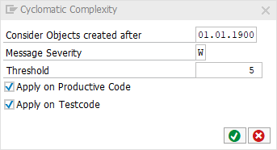

[BACK](../check_documentation.md)

# Cyclomatic Complexity Check
## What is the Intent of the Check?
The Cyclomatic Complexity Check is part of the Clean Code Check Repository. The cyclomatic complexity measures the complexity of a program, a class, a form or a module and is based on the control flow graph. It is a count for the number of linearly-independent paths through the source code.

A high value in cyclomatic complexity is an indicator that the source code is not readable anymore in a way that maintaining and extending the code can be done efficiently. In addition, the risk of introducing bugs is higher in code with high cyclomatic complexity.

## How does the check work?
In this implementation, the number of binary decision points "b" (for example, IF-statements) is counted.

The cyclomatic complexity M = b + 1

## Which attributes can be maintained?


## How to solve the issue?
Modularize the functionality into smaller blocks. This reduces the cyclomatic complexity and increases the readability.

## What to do in case of exception?
You can suppress Code Inspector findings generated by this check using the pseudo comment `"#EC CI_CYCLO`. The pseudo comment must be placed after the `ENDMETHOD` statement.

### Example
```abap
METHOD method_name.
  " Method content
ENDMETHOD. "#EC CI_CYCLO
```
