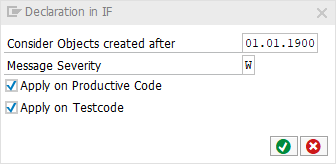

# Code Pal for ABAP

[Code Pal for ABAP](../../README.md) > [Documentation](../check_documentation.md) > [Declaration in IF Check](declaration-in-if.md)

## Declaration in IF Check

### What is the Intent of the Check?

The Declaration in IF check searches for declarative statements in optional structures as such statements can lead to confusion and issues during execution.

### How does the check work?

This check searches for `DATA`, `TYPES` and `FIELD-SYMBOLS` in `IF` statements and `IF` branches.

### Which attributes can be maintained?



### How to solve the issue?

Remove or relocate the declarations.

### What to do in case of exception?

You can suppress Code Inspector findings generated by this check using the pseudo comment `"#EC DECL_IN_IF`.  
The pseudo comment must be placed right after the declaration.

```abap
IF example = ''.
  TYPE type_declaration TYPE string. "#EC DECL_IN_IF
  FIELD-SYMBOLS: <field_declaration> TYPE any. "#EC DECL_IN_IF
  DATA data_declaration TYPE string. "#EC DECL_IN_IF
ENDIF.
```

### Further Readings & Knowledge

* [ABAP Styleguides on Clean Code](https://github.com/SAP/styleguides/blob/master/clean-abap/CleanABAP.md#dont-declare-inline-in-optional-branches)
