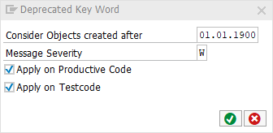

# code pal for ABAP

[code pal for ABAP](../../README.md) > [Documentation](../check_documentation.md) > [Deprecated Classes](deprecated-classes.md)

## Deprecated Classes

### What is the Intent of the Check?

It points out deprecated classes which should be replaced by newer objects.

You can check the list of supported objects in the `constructor` of the `y_check_deprecated_classes` class. 

### How does the check work?

This check searches for the usage of deprecated classes. For instance:
```abap
DATA aunit TYPE REF TO cl_aunit_assert.
```
### Which attributes can be maintained?



### How to solve the issue?

Reference non deprecated newer objects instead. For the above example, a corrected code would look like:
```abap
DATA aunit TYPE REF TO cl_abap_unit_assert.
```

### What to do in case of exception?

In very special and restricted cases (e.g.: for keeping downport release compatibility), you can suppress Code Inspector findings generated by this check using the pseudo comment `"#EC DEPRECATED_CLAS`.  The pseudo comment must be placed right after the statement:
```abap
DATA aunit TYPE REF TO cl_aunit_assert. "#EC DEPRECATED_CLAS` 
```

