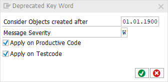

# code pal for ABAP

[code pal for ABAP](../../README.md) > [Documentation](../check_documentation.md) > [Deprecated Key Word Check](deprecated-key-word.md)

## Deprecated Key Word Check

### What is the Intent of the Check?

The Deprecated Key Word check points out old syntax which should be replaced with newer notations instead.

### How does the check work?

This check searches for the key words `MOVE` and `TRANSLATE` (but the CHECK will be soon enhanced with more deprecated ABAP Keywords).

### Which attributes can be maintained?



### How to solve the issue?

Use the newer notations instead.

### What to do in case of exception?

You can suppress Code Inspector findings generated by this check using the pseudo comment `"#EC DEPRECATED_KEY`. The pseudo comment must be placed right after the statement.

```abap
MOVE ….  "#EC DEPRECATED_KEY

TRANSLATE …. "#EC DEPRECATED_KEY
```
