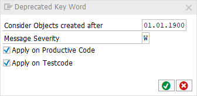

[BACK](../check_documentation.md)

# Deprecated Key Word Check
## What is the Intent of the Check?
The Deprecated Key Word check points out old syntax which should be replaced with newer notations instead.

## How does the check work?
This check searches for the key words `MOVE`, `TRANSLATE`, `CONCATENATE` and `READ TABLE`.

## Which attributes can be maintained?


## How to solve the issue?
Use the newer notations instead.
TODO: Link to annotations / small examples.

## What to do in case of exception?
You can suppress Code Inspector findings generated by this check using the pseudo comment `"#EC DEPRECATED_KEY`. The pseudo comment must be placed right after the statement.

### Example
```abap
MOVE ….  "#EC DEPRECATED_KEY

READ TABLE …. "#EC DEPRECATED_KEY
```
