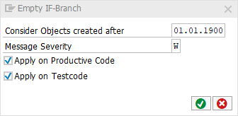

# code pal for ABAP

[code pal for ABAP](../../README.md) > [Documentation](../check_documentation.md) > [Empty IF Branches Check](empty-if-branches.md)

## Empty IF Branches Check

### What is the Intent of the Check?

The Empty IF Branches check searches for empty `IF` statements and empty `IF` branches.

### Which attributes can be maintained?



### How to solve the issue?

Fill the `IF` branch with code, remove it from the code or refactor the condition.

### What to do in case of exception?

You can suppress Code Inspector findings generated by this check using the pseudo comment `"#EC EMPTY_IF_BRANCH`. The pseudo comment has to be placed after the opening statement of the empty `IF` branch. In case of nested `IF`statements, the deepest within the branch.

```abap
IF name = ''.
  IF address = ''. "#EC EMPTY_IF_BRANCH

  ENDIF.
ENDIF.

IF name = ''. "#EC EMPTY_IF_BRANCH

ENDIF.

IF name = ''.
  " Source Code.
ELSEIF name = ''. "#EC EMPTY_IF_BRANCH

ELSE.
  " Source Code.
ENDIF.

IF name = ''.
  " Source Code.
ELSE. "#EC EMPTY_IF_BRANCH

ENDIF.
```

### Further Readings & Knowledge

* [ABAP Styleguides on Clean Code](https://github.com/SAP/styleguides/blob/master/clean-abap/CleanABAP.md#no-empty-if-branches)
