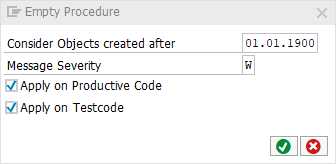

[BACK](../check_documentation.md)

# Empty Procedure Check
## What is the Intent of the Check?
The Empty Procedures check searches for empty methods, forms and modules.

## How does the check work?
The check highlights all empty code statements. Comments and Pragmas are also classified as "empty".

## Which attributes can be maintained?


## How to solve the issue?
Remove the empty code blocks if they are not required/obsolete.

## What to do in case of exception?
You can suppress Code Inspector findings generated by this check using the pseudo comment `"#EC EMPTY_PROCEDURE`. The pseudo comment must be placed right after the `ENDMETHOD` statement.

### Example
```abap
METHOD method_name.

ENDMETHOD. "#EC EMPTY_PROCEDURE
```
