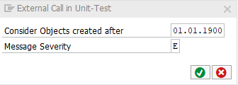

# code pal for ABAP

[code pal for ABAP](../../README.md) > [Documentation](../check_documentation.md) > [External Call in Unit Tests Check](external-call-in-ut.md)

## External Call in Unit Tests Check

### What is the Intent of the Check?

The Check “External Call in Unit-Test” scans test classes and its contents searching for any kind of explicit redirection (external call changing the main workflow to another program) within test methods. Since every external call/redirection is considered to be a dependency, this should not be allowed in test code.

### How does the check work?

The check searches for statements which may lead to an external call or redirection (e.g.: `SUBMIT`) deviating the regular workflow (call stack) of a program to another program.
The check also searches for any Remote Calls (RFCs) as well as instances or usage of `CL_GUI_*` classes (these should also be avoid in Unit Tests).

### Which attributes can be maintained?



### How to solve the issue?

The solution is either to remove or mock these external call/redirection with a proper dependency isolation technique.

### What to do in case of exception?

In special cases, it is possible to suppress a finding by using the pseudo comment `“#EC EXT_CALL_UT`.  
The pseudo comment must be placed right after the statement itself.

```abap
SUBMIT program.       “#EC EXT_CALL_UT
```
