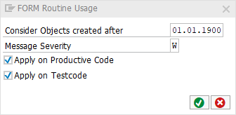

# code pal for ABAP

[code pal for ABAP](../../README.md) > [Documentation](../check_documentation.md) > [FORM Routine Check](form-routine.md)

## FORM Routine Usage Check

### What is the Intent of the Check?

`FORM` Routines are sub-routines in procedural programming. With the release of Object Oriented ABAP this syntax became obsolete.

### How does the check work?

This check searches for the usage of the `ENDFORM` statement.

### Which attributes can be maintained?



### How to solve the issue?

Use classes and methods instead. Methods are similar to subroutines and can be used for modularization.

### What to do in case of exception?

You can suppress Code Inspector findings generated by this check using the pseudo comment `"#EC CI_FORM`.  
The pseudo comment must be placed right after the `FORM` declaration.

```abap
FORM my_form. "#EC CI_FORM
  " Form content
ENDFORM.
```

### Further Readings & Knowledge

* [ABAP Styleguides on Clean Code](https://github.com/SAP/styleguides/blob/master/clean-abap/CleanABAP.md#prefer-object-orientation-to-procedural-programming)
