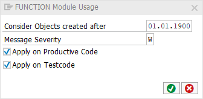

[BACK](../check_documentation.md)

# FUNCTION Routine Check
## What is the Intent of the Check?
`FUNCTION` Modules are sub-programs in procedural programming. With the release of Object Oriented ABAP this syntax became obsolete.

## How does the check work?
This check searches for Function Modules, that are not RFC enabled.

## Which attributes can be maintained?


## How to solve the issue?
Use classes and methods instead (Object Oriented ABAP).

## What to do in case of exception?
You can suppress Code Inspector findings generated by this check using the pseudo comment `"#EC CI_FUNCTION`.

## Example
```abap
FUNCTION my_function. "#EC CI_FUNCTION
    " Function content
ENDFUNCTION.
```

## Further Readings & Knowledge
* [ABAP Styleguides on Clean Code](https://github.com/SAP/styleguides/blob/master/clean-abap/CleanABAP.md#prefer-object-orientation-to-procedural-programming)
