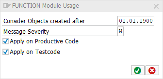

# code pal for ABAP

[code pal for ABAP](../../README.md) > [Documentation](../check_documentation.md) > [FUNCTION Routine Check](function-routine.md)

## FUNCTION Routine Check

### What is the Intent of the Check?

`FUNCTION` Modules are sub-programs in procedural programming. With the release of Object Oriented ABAP this syntax became obsolete.

### How does the check work?

This check searches for Function Modules within a function group. However, since Remote Function Calls (RFC) can only be executed via FUNCTION MODULES, these ones (Function Modules with RFC enablement) will not be caught by this check.

Note: This check does not search for the `CALL FUNCTION` statement within your source code (e.g. in a method or program).

### Which attributes can be maintained?



### How to solve the issue?

Use classes and methods instead (Object Oriented ABAP).

### What to do in case of exception?

You can suppress Code Inspector findings generated by this check using the pseudo comment `"#EC CI_FUNCTION`.

```abap
FUNCTION my_function. "#EC CI_FUNCTION
    " Function content
ENDFUNCTION.
```

### Further Readings & Knowledge

* [ABAP Styleguides on Clean Code](https://github.com/SAP/styleguides/blob/master/clean-abap/CleanABAP.md#prefer-object-orientation-to-procedural-programming)
