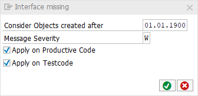

# code pal for ABAP

[code pal for ABAP](../../README.md) > [Documentation](../check_documentation.md) > [Interface in Class Check](interface-in-class.md)

## Interface in Class Check

### What is the Intent of the Check?

The "Is Interface in Class" check searches for public methods without an interface.

### How does the check work?

Since every class having at least one public method should implement an interface, this check searches for public methods within a class without having an associated interface (being implemented). 

### Which attributes can be maintained?



### How to solve the issue?

Make sure to implement an interface for the public methods. Even though this seems to be unnecessary in some cases, having an interface will easily allow mocking data in the future.

### What to do in case of exception?

You can suppress Code Inspector findings generated by this check using the pseudo comment `"#EC INTF_IN_CLASS`.  
The pseudo comment must be placed right after the `PUBLIC SECTION` statement.

```abap
CLASS class_name DEFINITION.
  PUBLIC SECTION. "#EC INTF_IN_CLASS
ENDCLASS.
```

### Further Readings & Knowledge

* [ABAP Styleguides on Clean Code](https://github.com/SAP/styleguides/blob/master/clean-abap/CleanABAP.md#public-instance-methods-should-be-part-of-an-interface)
