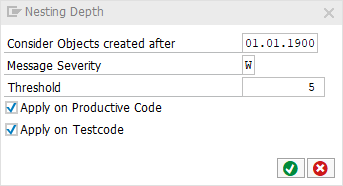

[BACK](../check_documentation.md)

# Maximum Nesting Depth Check
## What is the Intent of the Check?
The Maximum Nesting Depth is a count on the nesting level in a method, function module, form routine or module. A high value of nesting depth is an indicator that the source code is not readable anymore in a way that maintaining and extending the code can be done efficiently. In addition, the risk of introducing bugs is increased with a high nesting depth value.

## How does the check work?
The check taks the maximum number of nested code blocks within a method, function module, form routine or module.

`TEST-SEAM` statemetns do not add to the level of nesting depth.

## Which attributes can be maintained?


## How to solve the issue?
Modularize the functionality into smaller blocks. This increases the readability and efficiency.

## What to do in case of exception?
You can suppress Code Inspector findings generated by this check using the pseudo comment `"#EC CI_NESTING`. The pseudo comment must be placed right after the `ENDMETHOD` statement.

### Example
```abap
METHOD method_name.
  " Method content
ENDMETHOD. "#EC CI_NESTING
```

## Further Readings & Knowledge
* [ABAP Styleguides on Clean Code](https://github.com/SAP/styleguides/blob/master/clean-abap/CleanABAP.md#keep-the-nesting-depth-low)
