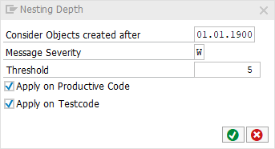

# code pal for ABAP

[code pal for ABAP](../../README.md) > [Documentation](../check_documentation.md) > [Nesting Depth Check](maximum-nesting-depth.md)

## Nesting Depth Check

### What is the Intent of the Check?

The "Nesting Depth" Check counts the nesting depth level of a method, function-module, form-routine or module. A high value of nesting depth is an indicator that the source code is not readable anymore in a way that maintaining and extending the code can be done efficiently. In addition, the risk of introducing bugs is increased with a high nesting depth value.

### How does the check work?

The check verifies if the number of nested code blocks within a method, function module, form routine or module has reached/exceeded a defined threshold (configurable).

OBS.: The `TEST-SEAM` statement does not count to the level of nesting depth (it is ignored).

### Which attributes can be maintained?



### How to solve the issue?

Modularize the functionality into smaller blocks. This increases the readability and efficiency.

### What to do in case of exception?

You can suppress Code Inspector findings generated by this check using the pseudo comment `"#EC CI_NESTING`.  
The pseudo comment must be placed right after the `ENDMETHOD` statement.

```abap
METHOD method_name.
...
  IF any_condition1.
    IF any_condition2.
      IF any_condition3.
        IF any_condition4.
          IF any_condition5.
            any_variable = abap_true.
          ENDIF.
        ENDIF.
      ENDIF.
    ENDIF.
  ENDIF.
ENDMETHOD. "#EC CI_NESTING
```

### Further Readings & Knowledge

* [ABAP Styleguides on Clean Code - keep the Nesting Depth low](https://github.com/SAP/styleguides/blob/master/clean-abap/CleanABAP.md#keep-the-nesting-depth-low)
