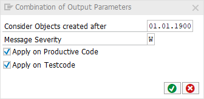

# code pal for ABAP

[code pal for ABAP](../../README.md) > [Documentation](../check_documentation.md) > [Combination of Output Parameters Check](method-output-parameter.md)

## Combination of Output Parameters Check

### What is the Intent of the Check?

The "Combination of Output Parameters" check searches for methods where a combination of `EXPORTING`, `CHANGING` and/or `RETURNING` parameters is used.

### Which attributes can be maintained?



### How to solve the issue?

Use just one sort of output type per method.

### What to do in case of exception?

You can suppress Code Inspector findings generated by this check using the pseudo comment `"#EC PARAMETER_OUT`.  
The pseudo comment must be placed right after the method definition header.

```abap
CLASS class_name DEFINITION.
  PUBLIC SECTION.
    METHOD method_name
      EXPORTING param1 TYPE c
      CHANGING param2  TYPE c
      RETURNING VALUE(result) TYPE c. "#EC PARAMETER_OUT
ENDCLASS.
```

### Further Readings & Knowledge

* [ABAP Styleguides on Clean Code - RETURN, EXPORT, or CHANGE exactly one parameter](https://github.com/SAP/styleguides/blob/master/clean-abap/CleanABAP.md#return-export-or-change-exactly-one-parameter)
