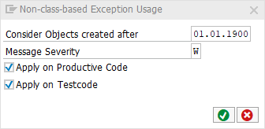

# code pal for ABAP

[code pal for ABAP](../../README.md) > [Documentation](../check_documentation.md) > [Non-Class Exception Check](non-class-exception.md)

## Non-Class Exception Check

### What is the Intent of the Check?

The “Non Class Exception” Check is part of the Clean Code Check Repository.

### How does the check work?

It search for non class-based exceptions like:

* `RAISE SYSTEM-EXCEPTIONS`
* `RAISE` ( without `EXCEPTION` or `RESUMABLE EXCEPTION` )
* `MESSAGE with RAISING`

### Which attributes can be maintained?



### How to solve the issue?

The solution is to use class-base exceptions like:

* `RAISE EXCEPTION`
* `RAISE RESUMABLE EXCEPTION`
* `RAISE SHORTDUMP`
* `THROW` ( in conditions )

### What to do in case of exception?

In special cases you can suppress this Check’s finding by using the pseudo comment `“#EC NON_CL_EXCEPT`.

```abap
RAISE SYSTEM-EXCEPTIONS.  "#EC NON_CL_EXCEPT

RAISE ex_name. "#EC NON_CL_EXCEPT

MESSAGE msg_name RAISING ex_name. "#EC NON_CL_EXCEPT
```

### Further Readings & Knowledge

* [ABAP Styleguides on Clean Code](https://github.com/SAP/styleguides/blob/master/clean-abap/CleanABAP.md#use-class-based-exceptions)
