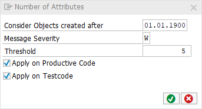

# code pal for ABAP

[code pal for ABAP](../../README.md) > [Documentation](../check_documentation.md) > [Number Attributes Check](number-attributes.md)

## Number Attributes Check

### What is the Intent of the Check?

The Number Attributes Check counts the number of attributes up to a maximum. If there are too many attributes in a class, it is probable that the [single responsibility principle](https://en.wikipedia.org/wiki/Single_responsibility_principle) is violated.

### How does the check work?

This check counts only `DATA` and `CLASS-DATA` within a global or local, `CLASS DEFINITION` or `INTERFACE`. Inherited attributes and all constants are not counted. A structure is counted as one attribute, no matter how many attributes are in the structure.

### Which attributes can be maintained?



### How to solve the issue?

Split the class or interface into multiple classes or interfaces which then contain less attributes. If there are many attributes related to one task, it's possible to group the attributes in structures.

### What to do in case of exception?

You can suppress Code Inspector findings generated by this check using the pseudo comment `"#EC NUMBER_ATTR`.  
The pseudo comment must be placed right after the class definition header.

```abap
CLASS class_name DEFINITION.   "#EC NUMBER_ATTR
  DATA data_1 TYPE t1.
  DATA data_2 TYPE t1.
  CLASS-DATA class_data_1 TYPE t1.
ENDCLASS.
```
