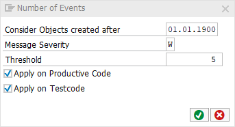

# code pal for ABAP

[code pal for ABAP](../../README.md) > [Documentation](../check_documentation.md) > [Number of Events Check](number-events.md)

## Number of Events Check

### What is the Intent of the Check?

The "Number of Events" Check counts the number of events up to a maximum. When a class hsa too many events, it is probable an indicator that the [single responsibility principle](https://en.wikipedia.org/wiki/Single_responsibility_principle) is violated.

### How does the check work?

This Check counts `EVENTS` and `CLASS-EVENTS` within a global or local, `CLASS DEFINITION` or `INTERFACE`.

### Which attributes can be maintained?



### How to solve the issue?

Split the class or interface into multiple classes or interfaces which then contain less events.

### What to do in case of exception?

You can suppress Code Inspector findings generated by this check using the pseudo comment `"#EC NUMBER_EVENTS`.  
The pseudo comment must be placed right after the class definition header.

```abap
CLASS class_name DEFINITION.   "#EC NUMBER_EVENTS
  EVENTS event_name_one.
  CLASS-EVENTS event_name_two.
ENDCLASS.
```
