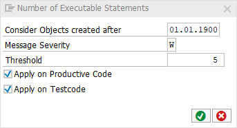

# Code Pal for ABAP

[Code Pal for ABAP](../../README.md) > [Documentation](../check_documentation.md) > [Number of Executable Statements Check](number-executable-statements.md)

## Number of Executable Statements Check

### What is the Intent of the Check?

The Number of Executable Statements Check counts the number of non-declarative ABAP Statements per modularization unit up to a maximum. If there are too many statements in a code block, it is probable that the [single responsibility principle](https://en.wikipedia.org/wiki/Single_responsibility_principle) is violated.

A high number of executable statements is an indicator that the source code is not readable anymore in a way that maintaining and extending the code can be done efficiently. In addition, the risk of introducing bugs is higher with a high number of executable statements in the code.

### How does the check work?

The check counts the number of non-declarative ABAP Statements, that is ABAP Statements without data declarations, program introduction statements, etc.

### Which attributes can be maintained?



### How to solve the issue?

Split the class or interface into multiple classes or interfaces which then contain less attributes. If there are many attributes related to one task, it's possible to group the attributes in structures.

### What to do in case of exception?

You can suppress Code Inspector findings generated by this check using the pseudo comment `"#EC CI_NOES`.  
The pseudo comment must be placed right after the `ENDMETHOD` statement.

```abap
METHOD method_name.
  " ...
ENDMETHOD. "#EC CI_NOES
```
