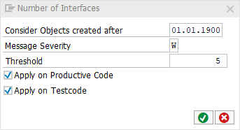

# code pal for ABAP

[code pal for ABAP](../../README.md) > [Documentation](../check_documentation.md) > [Number Interfaces Check](number-interfaces.md)

## Number Interfaces Check

### What is the Intent of the Check?

The Number Interfaces Check counts the number of interfaces up to a maximum. If there are too many interfaces in a class, it is probable that the [single responsibility principle](https://en.wikipedia.org/wiki/Single_responsibility_principle) is violated.

### How does the check work?

This check counts `INTERFACES` within a global or local, `CLASS DEFINITION` or `INTERFACE`.

### Which attributes can be maintained?



### How to solve the issue?

Split the class or interface into multiple classes or interfaces which then contain less interfaces.

### What to do in case of exception?

You can suppress Code Inspector findings generated by this check using the pseudo comment `"#EC NMBR_INTERFACES`.  
The pseudo comment must be placed right after the class definition header.

```abap
CLASS class_name DEFINITION.   "#EC NMBR_INTERFACES
  INTERFACES interface_name_one.
  INTERFACES interface_name_two.
ENDCLASS.
```
