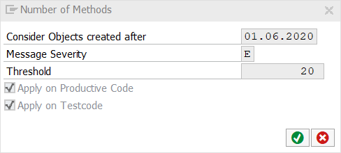

# Code Pal for ABAP

[Code Pal for ABAP](../../README.md) > [Documentation](../check_documentation.md) > [Number Methods Check](number-methods.md)

## Number Methods Check

### What is the Intent of the Check?

The Number Methods check counts the number of methods up to a maximum. If there are too many methods in a class, it is probable that the [single responsibility principle](https://en.wikipedia.org/wiki/Single_responsibility_principle) is violated.

### How does the check work?

This check counts `METHODS` and `CLASS-METHODS` within a global or local, `CLASS DEFINITION` or `INTERFACE`. Inherited methods aren't counted, however `REDEFINED METHODS` increment the counter.

### Which attributes can be maintained?



### How to solve the issue?

The solution is to split the class or interface into multiple classes or interfaces which then contain less methods.

### What to do in case of exception?

You can suppress Code Inspector findings generated by this check using the pseudo comment `"#EC NUMBER_METHODS`.  
The pseudo comment must be placed right after the class definition header.

```abap
CLASS class_name DEFINITION.   "#EC NUMBER_METHODS
  METHODS method_name_one.
  CLASS-METHODS method_name_two.
ENDCLASS.
```
