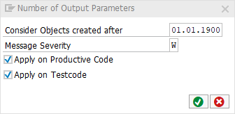

# code pal for ABAP

[code pal for ABAP](../../README.md) > [Documentation](../check_documentation.md) > [Number of Output Parameters Check](number-output-parameter.md)

## Number of Output Parameters Check

### What is the Intent of the Check?

The "Number of Output Parameters Check" searches for methods where more than one parameter in one of the output types (`EXPORTING`, `CHANGING` or `RETURNING`) is used.

### Which attributes can be maintained?



### How to solve the issue?

Use methods which return just one parameter per output type. If you have multiple output parameters which are related to each other, use a structure to group them.

### What to do in case of exception?

You can suppress Code Inspector findings generated by this check using the pseudo comment `"#EC NUM_OUTPUT_PARA`.  
The pseudo comment must be placed right after the method definition.

```abap
CLASS class_name DEFINITION.
  PUBLIC SECTION.
    METHOD method_name
      EXPORTING
        param1 TYPE c
        param2 TYPE i
      CHANGING
        param2  TYPE c
      RETURNING
        VALUE(result) TYPE c.  "#EC NUM_OUTPUT_PARA
ENDCLASS.
```
