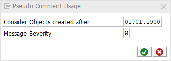

# Code Pal for ABAP

[Code Pal for ABAP](../../README.md) > [Documentation](../check_documentation.md) > [Pseudo Comment Usage Check](pseudo-comment-usage.md)

## Pseudo Comment Usage Check

### What is the Intent of the Check?

The pseudo comment usage check lists the number of Clean Code pseudo comments per object. Pseudo comments completely suppress the findings in ATC. Thus, this check can be used whether objects without any other finding use a lot of clean code pseudo comments to suppress findings.

### How does the check work?

It simply counts the number of used clean code pseudo comments.

### Which attributes can be maintained?

### How to solve the issue?

Solve the other issues so that less pragmas are used.

### What to do in case of exception?

There should be no exception as the check works as an indication. Thus, it is also not possible to suppress Code Inspector findings from this check.
