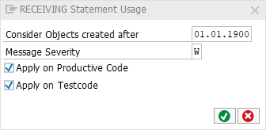

# Code Pal for ABAP

[Code Pal for ABAP](../../README.md) > [Documentation](../check_documentation.md) > [RECEIVING Usage Check](receiving-usage.md)

## RECEIVING Usage Check

### What is the Intent of the Check?

The “Receiving Usage” Check is part of the Clean Code Check Repository.

### How does the check work?

This check checks the usage of the `RECEIVING` statement.

### Which attributes can be maintained?



### How to solve the issue?

`RECEIVING` shall not be used.
```abap
DATA(sum) = aggregate_values( values ).
```

### What to do in case of exception?

In special cases you can suppress this finding by using the pseudo comment: `“#EC RECEIVING_USAGE`.

```abap
aggregate_values(
    EXPORTING
        values = values
    RECEIVING
        result = DATA(sum) ).   "#EC RECEIVING_USAGE
```

### Further Readings & Knowledge

* [ABAP Styleguides on Clean Code](https://github.com/SAP/styleguides/blob/master/clean-abap/CleanABAP.md#omit-receiving)
