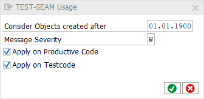

# code pal for ABAP

[code pal for ABAP](../../README.md) > [Documentation](../check_documentation.md) > [Test Seam Usage Check](test-seam-usage.md)

## Test Seam Usage Check

### What is the Intent of the Check?

The “Test Seam Usage” Check is part of the Clean Code Check Repository. Test seams are invasive and tend to get entangled in private dependencies, such that they are hard to keep alive and stable in the long run.

### How does the check work?

This check searches for usage of the `TEST-SEAM` statement.

### Which attributes can be maintained?



## How to solve the issue?

`TEST-SEAM` shall not be used.

### What to do in case of exception?

You can suppress Code Inspector findings generated by this check using the pseudo comment `"#EC TEST_SEAM_USAGE`.  
The pseudo comment must be placed right after the declaration.

### Example

```abap
TEST-SEAM seam_name.    "#EC TEST_SEAM_USAGE
```

### Further Readings & Knowledge

* [ABAP Styleguides on Clean Code](https://github.com/SAP/styleguides/blob/master/clean-abap/CleanABAP.md#use-test-seams-as-temporary-workaround)
