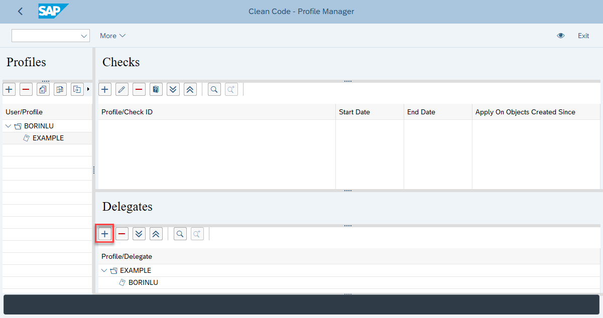

# Code Pal for ABAP 

## How to Configure via Profiles
You can create and assign multiples profiles to users.

**Important**:
* If you have any profile active for your user, the code pal for ABAP will execute only the checks assigned to a active profile;
* If you unassign a profile, the tool won't deleted it. It means, you can reassign it to your user, and all the checks with respective customization will come back.

### 1. Create Profile
Start transaction `Y_CODE_PAL_PROFILE`, click on the `+` button, and inform the profile name.

### 2. Assign Delegates
Delegates are users which can maintain the checks. As you are creating a new check, you will be added automatically. In case you want to add someone else as owner, click on the `+` button and inform his/her SAP name.

### 3. Assign Checks
Click on the `+` button and assign the checks.

The check has a default customizing, which doesn't mean the SAP standards.  
If you want to change the default check configuration, you can set it here:

The check documentation is avaiable in the help button:

## How to export and import customization 
The export/import feature allows you to export and import a profile with its delegates and checks between systems using a `JSON` file. 

