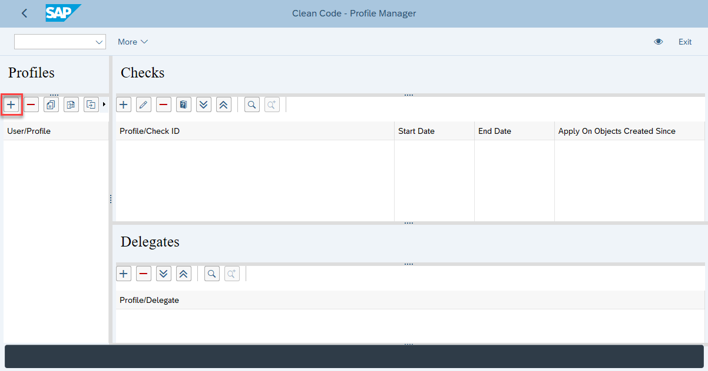
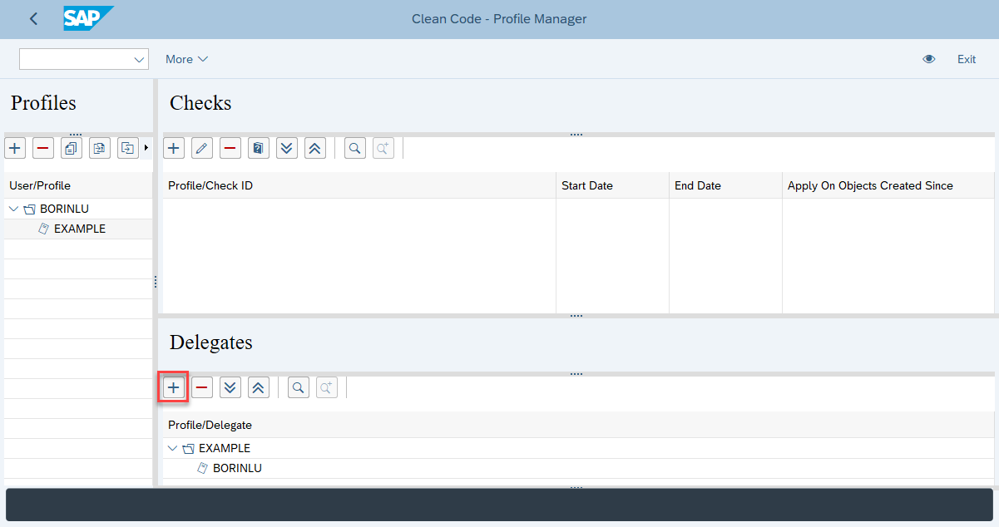
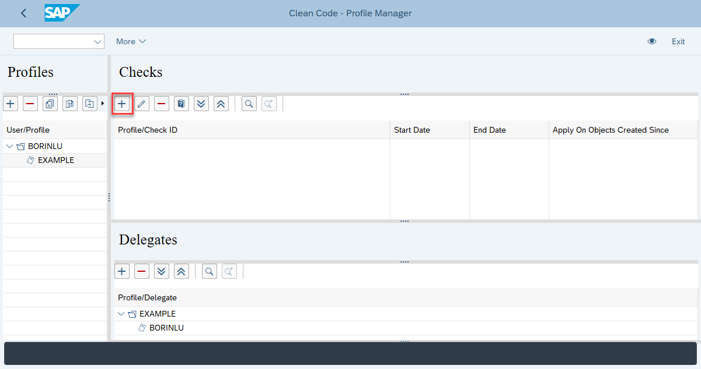
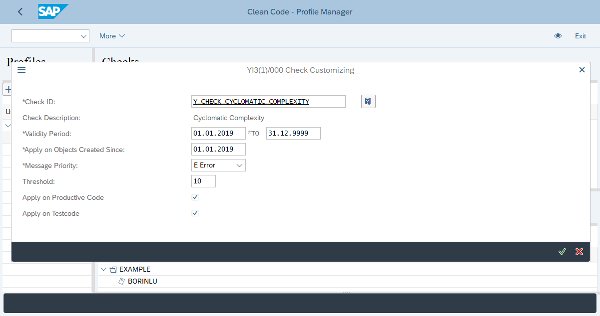
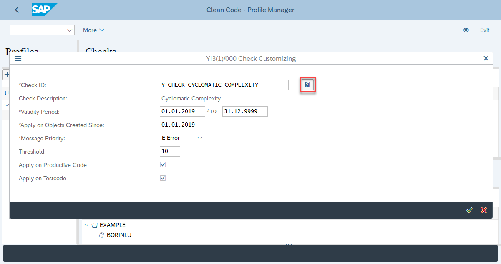
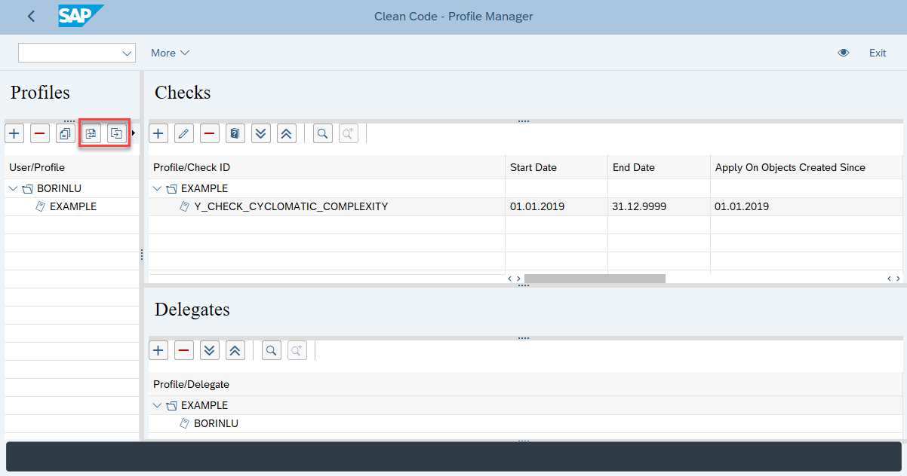

# Code Pal for ABAP

[Code Pal for ABAP](../README.md) > [How to Configure](how-to-configure.md)

## How to Configure

**The default customizing (initial values) is not an SAP delivered standard value.**  

The tool is 100% compatible with the SAP CI Framework (Code Inspector). That is, SAP Transactions: SCI and SCII. By means of these transactions, it is possible to create/run/save an inspection using our delivered CHECKS (the checks can be found under the "CODE PAL FOR ABAP" category). 
It is also possible to create a CI-Variant and run the selected CHECKS using this variant at any time. This CI-Variant can be also used in SUT (ABAP CHECK REPORT), ATC or even using SAP-Workbench ABAP Editors (e.g.: SE80) or ADT (e.g.: Eclipse) with ATC/CI Integration directly (the CI-Variant will be asked).

In summary, it is possible to use our tool directly in SCI/SCII, via ATC Integration, via API Call, via SUT, via CI-Variant or via Profile(s).
But keep in mind, one has to choose betweeen using CI-Variants or Using Profile(s). Both features cannot be used in paralell in the same system for the same user. 

Every CHECK can be configurable independenlty.

Check configuration: You can,

* Define check's validity period;
* Restrict to objects created since a specific date;
* Define check's severity;
* Define check's threshold (if applicable);
* Define if it is applicable in productive code (if applicable);
* Define if it is applicable in test code (if applicable).

Check behavior:

* If using a CI-Variant, just one variant can be executed per time. 
* If using a profile, first, at least one profile should be assigned to your user. Then, all checks assigned to this profle will be executed. But if so, the usage of a CI-variant is no longer possible. The profile overrules a CI-variant! In order to use again a CI-variant, one has to unassign the profile(s) of his/her user;
* If multiple profiles are assigned to your user, all checks assigned to all profiles will be executed and the "strongest" or "sharpest" thresholds will be taken;
* If have no profile assigned to your user, the execution of the checks have to be made live in SCI/SCII or by means of a CI-Variant.

Profile behavior:

* If you unassign a profile from your user, it will not delete it from the database. It means, you can reassign it to your user, and all the checks with respective customization will return;
* If you assign the `Y_CHECK_PROFILE_MESSAGE` check to the profile, you will receive an info message every time you execute the global check variant. It means, not all the checks from the variant were executed, but so the ones related to the active profile.

Threshold behavior:

* If you have multiple profiles, and the same check assigned to two or more profiles, it will use the check with the strongest threshold.
  
### 1. Create or Assign a Profile

Start transaction `Y_CODE_PAL_PROFILE`, click on the `+` button, and inform the profile name.

You can assign an already existing profile to your user. It is useful for working on a team based on the same checks.

### 2. Assign Delegates

Delegates are users which can maintain the checks. As you are creating a new check, you will be added automatically. In case you want to add someone else as an owner, click on the `+` button and inform his/her user name.

### 3. Assign Checks

Click on the `+` button and assign the checks.

If you want, you can change the default configuration:

If you do not understand the check meaning, you can check its documentation:

## How to export and import customization

You can export and import profiles, with respective delegates and checks, using a `JSON` file.

It is useful when you work with multiple systems, and you want to sync the profiles between them.

### Import via API

Once you export a profile to a `JSON` file, you can import it using the service created in the [How To Install](how-to-install.md) guide.

To consume the API, you have to `POST` the `JSON` file to the service with the respective authentication you configured to the service (usually basic, user/pass) and with the header `Content-Type` as `application/json` and `action` as `import_profile`.

The API returns an `HTTP 400 - Bad Request` if the file format is not valid, or if the request has a wrong `Content-Type`.

The API returns an `HTTP 403 - Forbidden` if the profile already exists in the system and the authentication user is not listed as a delegate.

The API returns an `HTTP 500 - Internal Server Error` if the functionality is not working as expected.
