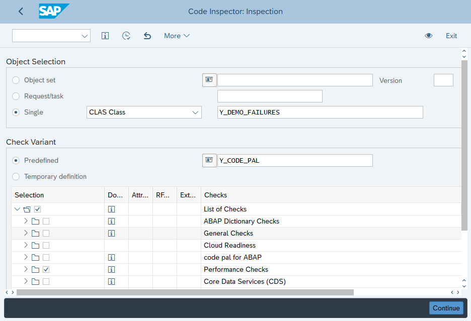
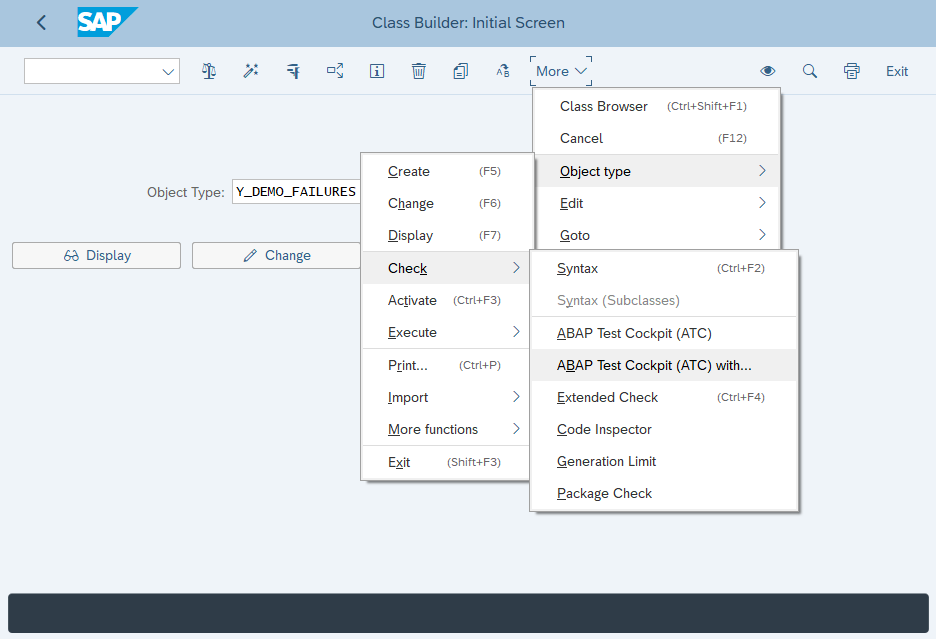
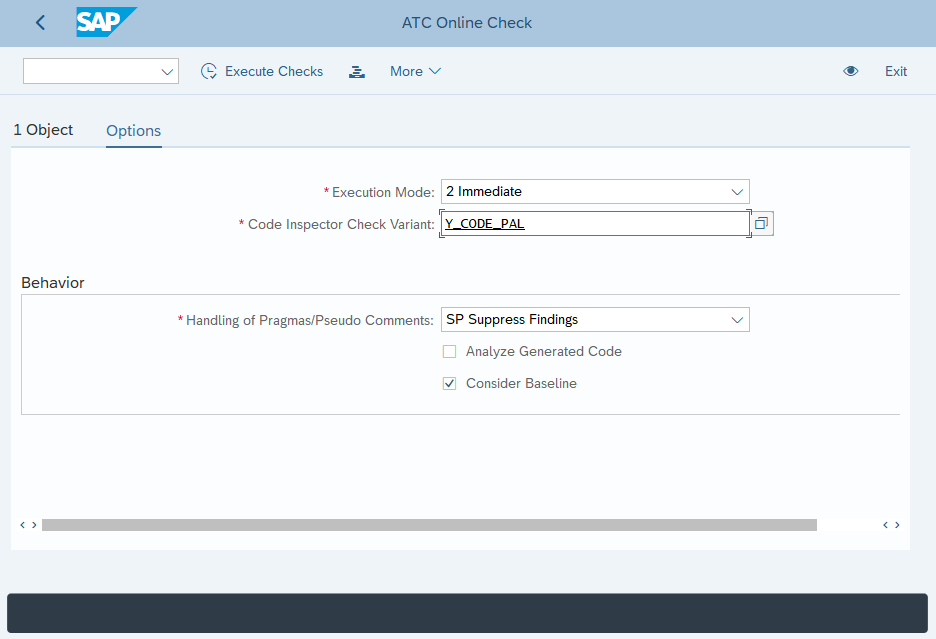
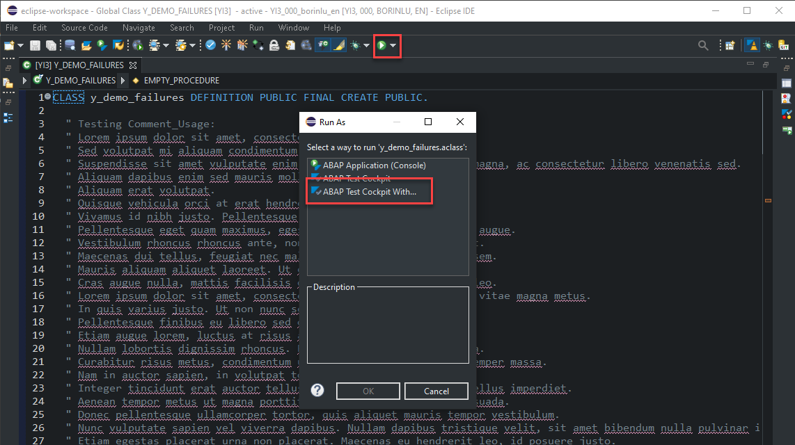

# Code Pal for ABAP

[Code Pal for ABAP](../README.md) > [How to Execute](how-to-execute.md)

## How to Execute

You can use the **Code Inspector (SCI)**, the **ABAP Test Cockpit (ATC)**, and the **System Utilities & Tools (SUT)** (SAP only). 

💡 Code Pal provides two example objects with errors so that you can run the Checks. You can scan the `Y_CODE_PAL_EXAMPLE` program or class.

### 1. Code Inspector (SCI)

> Transaction: `SCII`

Inform the `Object Selection` and the `Check Variant` or the `Temporary Definition` using the `code pal for ABAP` selection, and run it:

### 2. ABAP Test Cockpit (ATC)

The `User Parameter` mentioned in the [`How to Install`](how-to-install.md) is required. 

#### 2.1 SAP GUI

> Transaction: `SE38`, `SE24`, `SE37`, `SE80`, etc

In the menu, run `Check` > `ABAP Test Cockpit (ATC) with...`:

Under `Options`, inform the `Check Variant`:  

#### 2.2 Eclipse

In the menu, select `Run As` > `ABAP Test Cockpit With...`, and inform the Check Variant:

### 3. System Utilities & Tools (SUT)

> Transaction: `SUT`

In the transaction `SUT` run the `ABAP Check Report` informing the `Selection Criteria`, and the `Check Scope`: 

