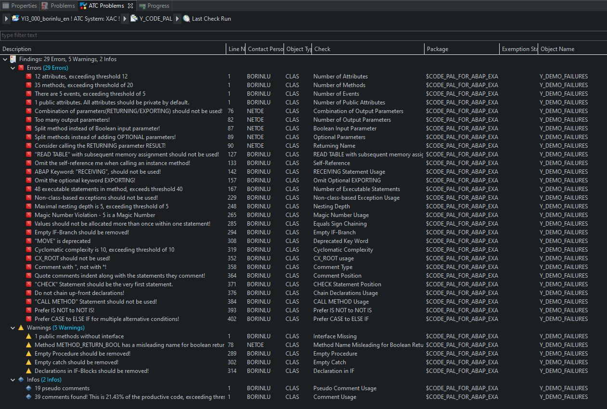

# Code Pal for ABAP

[Code Pal for ABAP](../README.md) > [How to Execute](how-to-execute.md)

You can simulate the checks using the provided `Y_DEMO_FAILURES` class.

## SAP Gui

## Eclipse

Select `Run As` > `ABAP Test Cockpit With...`, and enter your Global Variant Name.

## Result

When code pal is in your system, just go to Transaction `SCI` or `SCII` 

To understand how the checks work, please refer to the 

