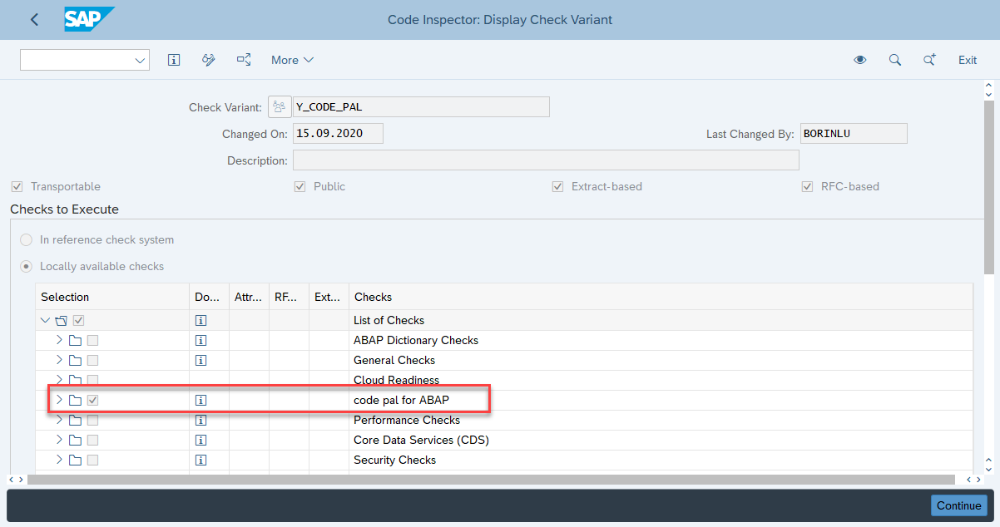
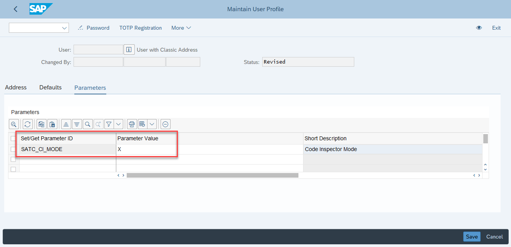

# Code Pal for ABAP

[Code Pal for ABAP](../README.md) > [How to Install](how-to-install.md)

## How to Install

### 1. Clone repository using abapGit

Follow the step-by-step available in the abapGit documentation: [Installing online repo](https://docs.abapgit.org/guide-online-install.html).

> Please, use folder logic `PREFIX`

### 2. Activate code pal for ABAP

Execute the report `Y_CODE_PAL_REGISTRATION` using the run mode `Activate`.

### 3. Create code inspector variant

Start the transaction `SCI`, create a new Check Variant, select the `code pal for ABAP` group, and save it:

### 4. User Parameter

Code Pal requires ABAP Test Cockpit (ATC) in `Code Inspector` mode.  
Instead of changing the default configuration, you can force it on your User only. 

To set it, go to transaction `SU3`, and add the user parameter `SATC_CI_MODE` as `X`:
