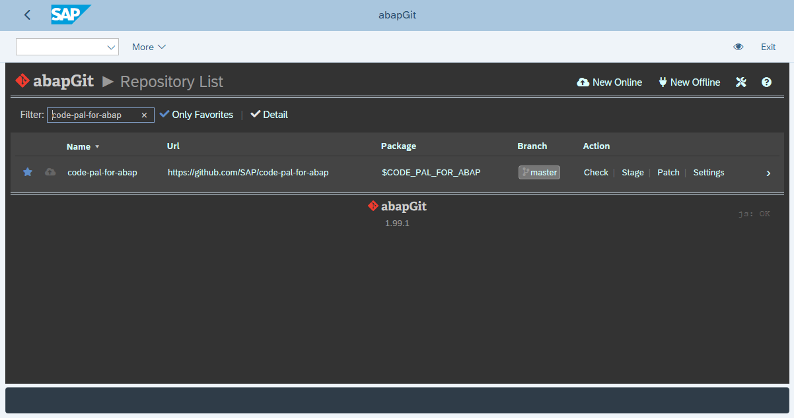

# Code Pal for ABAP

[Code Pal for ABAP](../README.md) > [How to Install](how-to-install.md)

## How to Install

### 1. Clone repository using abapGit

Follow the step-by-step available in the abapGit documentation: [Installing online repo](https://docs.abapgit.org/guide-online-install.html).

> Please, use folder logic `PREFIX`.

### 2. Activate code pal for ABAP category

Start the transaction `SCI`, and go to the `Code Inspector > Management of > Checks` menu.  
Then, select the `Y_CATEGORY_CODE_PAL` check class and save it.

(In some system releases, the path to the `Check Management` might differ from the screenshot.)

### 3. Activate code pal for ABAP checks

Start the transaction `SCI` again, and go to the `Code Inspector > Management of > Checks` menu.  
Then, select all the `Y_CHECK_*` check classes and save it.

### 4. Create code inspector variant

Start the transaction `SCI` again, and create a new global check variant.  
Then, select the `code pal for ABAP` group and save it.

### 5. User Parameter

It requires you to set the ABAP Test Cockpit (ATC) to run in Code Inspector mode.

Start the transaction `SU3`, and add/set the user parameter `SATC_CI_MODE` to `X`:

### 6. Service

> :warn: Optional Feature!

Start the transaction `SICF`, and create a service using the `Y_CODE_PAL_SERVICE` handler. Use procedure `Standard`, set the security session to `Completely Restricted` and check the `Use all logon procedures`.

The client, user, and password will be empty as to will provide the authentication when you consume the API.
